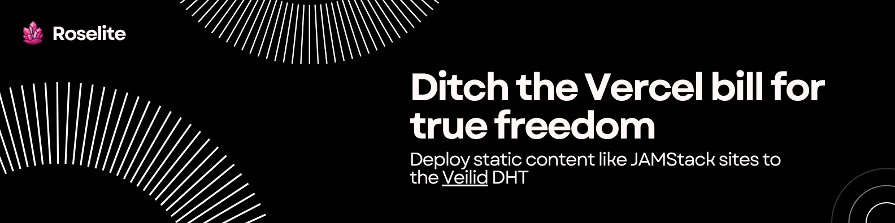

# Roselite - P2P Static Site Hosting via Veilid DHT

Deploy static content like JAMStack sites to the [Veilid](https://veilid.com) DHT with instant web access through gateway servers. **Zero censorship, zero single points of failure** - your content lives forever in the decentralized network.

## 🚀 Features

- **📦 Simple Packaging**: Bundle static sites into `.veilidpkg` format
- **🌐 Instant Deployment**: Publish to Veilid DHT with one command  
- **🌍 Gateway Server**: Full HTTP server for web browser access via subdomains
- **🔗 Universal Access**: Automatic gateway URLs with SSL termination
- **🔐 Decentralized**: Content stored in Veilid DHT, served through gateways
- **🚫 Zero Censorship**: No central authority can remove your content
- **🌍 Unstoppable**: Multiple gateway redundancy prevents takedowns
- **🎯 Developer Friendly**: Four commands: bundle, publish, gateway, access

## 🏗️ How It Works

```
Static Site → Bundle → Veilid DHT → Gateway Server → Web Browser
(HTML/CSS/JS) (.veilidpkg) (Distributed) (subdomain.domain.com) (HTTPS)
                            ↑
                    CENSORSHIP-RESISTANT
                    No single point of control
```

1. **Bundle** your static site files into a package
2. **Publish** the package to Veilid's distributed hash table  
3. **Gateway** serves content via subdomain routing (e.g., `my-site.localhost:8080`)
4. **Share** the gateway URL - fully accessible in any web browser
5. **Survive** - Content remains accessible even if gateways are blocked

## 🛠️ Installation & Usage

### Prerequisites

- **Rust** 1.70+ (install via [rustup.rs](https://rustup.rs))
- **Static Website** (HTML/CSS/JS files ready to deploy)

### Quick Start

```bash
# 1. Clone and build
git clone https://github.com/jdbohrman/roselite
cd roselite
cargo build --release

# 2. Bundle your static site
./target/release/roselite-cli bundle ./my-website

# 3. Publish to Veilid DHT
./target/release/roselite-cli publish my-website.veilidpkg

# 4. Run gateway server
./target/release/roselite-gateway --domain mydomain.com --port 8080

# 5. Access via browser
# http://localhost:8080 (with Host: your-site-key.mydomain.com)
```

### Detailed Commands

#### Bundle Static Sites
```bash
# Bundle a directory into .veilidpkg
roselite-cli bundle ./dist

# Specify custom output name
roselite-cli bundle ./dist --output my-site.veilidpkg
```

#### Publish to DHT
```bash
# Publish package to Veilid network
roselite-cli publish my-site.veilidpkg

# Returns: VLD0:ABCDEFxxxxxx (your DHT key)
```

#### Run Gateway Server  
```bash
# Basic gateway
roselite-gateway --domain example.com --port 8080

# With custom cache directory
roselite-gateway --domain example.com --port 8080 --cache ./custom-cache

# Production mode with SSL proxy (coming soon)
roselite-gateway --domain example.com --proxy --ssl
```

#### DNS Configuration
For public access, configure DNS records:

```dns
# TXT record for DHT resolution
your-site.example.com TXT "veilid-app=VLD0:YOUR_DHT_KEY_HERE"

# A record pointing to your gateway server
your-site.example.com A 123.456.789.10
```

## 🏛️ Architecture

### Veilid DHT Storage
- Content stored as compressed tar archives in Veilid DHT
- Cryptographically signed and immutable once published
- Distributed across multiple nodes for redundancy
- No central server can delete or modify content

### Gateway Servers
- **Local Development**: Run `roselite-gateway` on localhost
- **Self-Hosted**: Deploy on your VPS/cloud instance  
- **Public Gateways**: Universal access points (coming soon)

### DNS Integration
- **TXT Records**: Map domains to DHT keys
- **Subdomain Routing**: `site-key.gateway-domain.com`
- **SSL Support**: Automatic HTTPS via Let's Encrypt (planned)

## 🌍 Universal Gateway Network (Coming Soon)

We're launching a network of public gateway servers for universal access:

### Planned Features
- **Public Gateway Nodes**: Multiple geographic locations
- **Automatic HTTPS**: SSL certificates via Let's Encrypt
- **CDN Integration**: Edge caching for faster content delivery
- **Custom Domains**: Point your domain to any gateway
- **Load Balancing**: Automatic failover between gateways
- **Zero Configuration**: Publish once, access anywhere

### Gateway Locations (Planned)
- 🇺🇸 US East (Virginia)
- 🇺🇸 US West (California) 
- 🇪🇺 EU (Frankfurt)
- 🇦🇺 Asia-Pacific (Singapore)

### Usage
```bash
# Publish once
roselite-cli publish my-site.veilidpkg
# → Returns: VLD0:ABCDEFxxxxxx

# Access from anywhere
https://VLD0-ABCDEFxxxxxx.roselite.network
https://VLD0-ABCDEFxxxxxx.gateway.veilid.com
```

## 🔧 Development

### Project Structure
```
roselite/
├── roselite-cli/     # Command-line bundling & publishing tools
├── roselite-gateway/ # HTTP gateway server
├── roselite-core/    # Shared Veilid integration logic
└── examples/         # Example sites and configurations
```

### Building from Source
```bash
git clone https://github.com/jdbohrman/roselite
cd roselite
cargo build --release
```

### Running Tests
```bash
cargo test --all
```

## 🐛 Troubleshooting

### Common Issues

**"Veilid network not ready"**
- Wait 30-60 seconds for initial DHT connection
- Check internet connectivity
- Ensure no firewall blocking UDP traffic

**"File not found" on gateway**
- Verify DNS TXT record is correct
- Check DHT key format: `VLD0:...`
- Clear gateway cache: `rm -rf .cache/`

**Gateway not starting**
- Check port availability: `netstat -an | grep :8080`
- Verify domain ownership for SSL mode
- Review logs for Veilid connection errors

## 📝 License

Apache 2.0 License - see [LICENSE](LICENSE) file for details.

## 🤝 Contributing

Contributions welcome! Please see [CONTRIBUTING.md](CONTRIBUTING.md) for guidelines.

## 💖 Sponsor This Project

Roselite is developed by [@jdbohrman](https://github.com/jdbohrman) with the goal of creating truly decentralized, censorship-resistant web hosting. If this project helps you deploy uncensorable websites, consider supporting development:

<div align="center">

<a href="https://www.buymeacoffee.com/jdbohrman.tech" target="_blank"></a>

**[☕ Support on coff.ee/jdbohrman.tech](https://coff.ee/jdbohrman.tech)**

</div>

### Goals & Vision
- 🌐 **Universal Gateway Network**: Public gateways worldwide for instant access
- 🔒 **Enhanced Security**: E2E encryption and content verification
- 🚀 **Developer Tools**: CLI improvements, web dashboard, API integrations
- 📱 **Mobile Apps**: Native iOS/Android apps for publishing and browsing
- 🌍 **Community**: Growing the ecosystem of decentralized web hosting

Your support helps maintain public gateways, develop new features, and keep the internet free and open for everyone.

---

*Built with ❤️ for a decentralized web*
