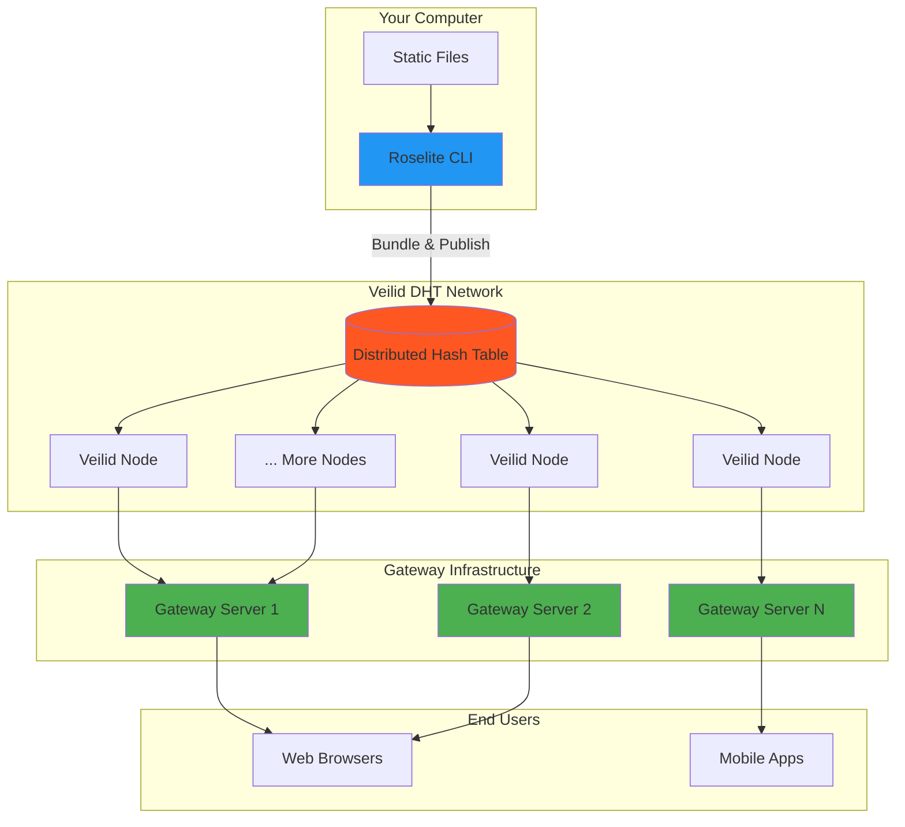
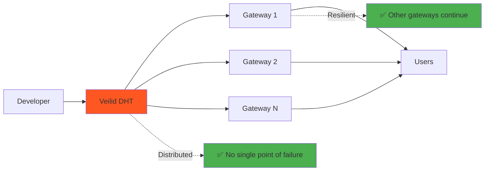

# Architecture

Roselite is built on a foundation of **decentralized infrastructure** and **censorship-resistant design**. This section explains how the system works and why it's different from traditional hosting.

## High-Level Overview

Roselite consists of three main components working together:



## Core Components

### 1. Roselite CLI
The command-line tool for content creators:
- **Bundles** static sites into `.veilidpkg` format
- **Publishes** packages to the Veilid DHT
- **Manages** content lifecycle and updates

### 2. Veilid DHT Network
The decentralized storage layer:
- **Stores** content across hundreds of nodes globally
- **Replicates** data for redundancy and availability
- **Encrypts** content with cryptographic security
- **Distributes** load across the network

### 3. Gateway Servers
HTTP bridges for web access:
- **Retrieves** content from the DHT on demand
- **Serves** via standard HTTP/HTTPS protocols
- **Caches** content for performance
- **Routes** subdomain requests to correct content

## Design Principles

### Decentralization First

**No Single Point of Failure**: Unlike traditional hosting where your site lives on one server, Roselite distributes content across hundreds of nodes. If some nodes go offline, your content remains accessible.

**Gateway Independence**: Multiple gateway servers can serve the same content. If one gateway is blocked or goes down, others continue working.

### Censorship Resistance

**Network-Level Resistance**: Content stored in the DHT cannot be easily removed or censored since there's no central authority.

**Access-Level Resistance**: Multiple gateways in different jurisdictions mean blocking one access point doesn't prevent access through others.

**Technical Resistance**: Direct DHT access means content can be retrieved even without gateway servers.

### Developer Experience

**Simple Workflow**: The familiar static site workflow remains unchanged - just add Roselite deployment.

**Zero Configuration**: Works out of the box with any static site generator or plain HTML.

**Instant Deployment**: No server provisioning, DNS configuration, or certificate management.

## What makes it different

### Traditional Hosting
```mermaid
graph LR
    Dev[Developer] --> Server[Single Server]
    Server --> CDN[CDN (Optional)]
    CDN --> Users[Users]
    
    Server -.->|SPOF| X[❌ Server Down = Site Down]
    CDN -.->|Censorship| Y[❌ Can be blocked/removed]
    
    style X fill:#ff5722
    style Y fill:#ff5722
```

### Roselite Hosting


## Deep Dive Sections

Ready to learn more? Explore each component in detail:

<div class="grid cards" markdown>

-   :material-eye:{ .lg .middle } **System Overview**

    ---

    Complete system architecture and data flow

    [:octicons-arrow-right-24: Overview](overview.md)

-   :material-network:{ .lg .middle } **DHT Integration**

    ---

    How Roselite integrates with Veilid DHT

    [:octicons-arrow-right-24: DHT Integration](dht-integration.md)

-   :material-server:{ .lg .middle } **Gateway System**

    ---

    Gateway architecture and HTTP bridging

    [:octicons-arrow-right-24: Gateway System](gateway-system.md)

-   :material-shield:{ .lg .middle } **Security Model**

    ---

    Cryptographic security and threat analysis

    [:octicons-arrow-right-24: Security Model](security-model.md)

</div>

## Key Benefits

!!! success "Censorship Resistance"

    Content distributed across the Veilid network cannot be easily censored or removed by any single authority.

!!! success "High Availability"

    Multiple redundant access points ensure your content remains available even during outages or blocking attempts.

!!! success "Zero Ongoing Costs"

    No monthly hosting fees, bandwidth charges, or server maintenance costs.

!!! success "Global Performance"

    Gateway caching and DHT distribution provide fast access from anywhere in the world.

!!! success "Developer Friendly"

    Works with existing static site generators and deployment workflows.

## Use Cases

### Perfect for:
- **Documentation sites** that need permanent availability
- **Personal portfolios** without hosting costs
- **Open source projects** requiring censorship resistance
- **Emergency information** that must survive infrastructure failures
- **Educational content** in restricted environments

### Consider alternatives for:
- **Dynamic applications** requiring server-side processing
- **E-commerce sites** needing payment processing
- **Sites requiring frequent updates** (though possible, static regeneration is more efficient)
- **Very large media files** (DHT is optimized for reasonably-sized content)

## Next Steps

- [Overview](overview.md) - Detailed system architecture
- [Getting Started](../getting-started/) - Deploy your first site
- [Reference](../reference/) - Complete API documentation 