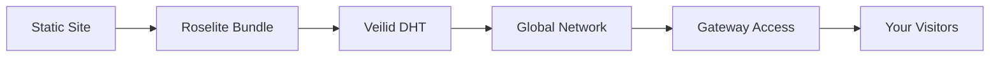

# Roselite Documentation

<div class="hero-section" markdown>
  <h1 class="hero-title">🌹 Roselite</h1>
  <p class="hero-subtitle">A peer-to-peer static site hosting platform built on the Veilid DHT network. Publish and share your websites without centralized servers.</p>
  
  [Get Started :material-rocket-launch:](installation.md){ .md-button .md-button--primary }
  [View on GitHub :fontawesome-brands-github:](https://github.com/jdbohrman/roselite){ .md-button }
</div>

<div class="feature-grid" markdown>
  <div class="feature-card" markdown>
    <div class="feature-icon">🌐</div>
    <h3 class="feature-title">Decentralized Hosting</h3>
    <p class="feature-description">Host your static sites on a distributed network without relying on centralized servers. Your content is resilient and always available.</p>
  </div>

  <div class="feature-card" markdown>
    <div class="feature-icon">🔒</div>
    <h3 class="feature-title">Private & Secure</h3>
    <p class="feature-description">Built on Veilid's privacy-focused DHT network. Your data is encrypted and distributed across a secure peer-to-peer network.</p>
  </div>

  <div class="feature-card" markdown>
    <div class="feature-icon">⚡</div>
    <h3 class="feature-title">Easy to Use</h3>
    <p class="feature-description">Simple CLI commands to bundle and publish your static sites. Works with any static site generator or plain HTML.</p>
  </div>

  <div class="feature-card" markdown>
    <div class="feature-icon">🚀</div>
    <h3 class="feature-title">Built with Rust</h3>
    <p class="feature-description">Fast, reliable, and memory-safe. Roselite is built with modern Rust for performance and security.</p>
  </div>

  <div class="feature-card" markdown>
    <div class="feature-icon">🔄</div>
    <h3 class="feature-title">Version Control</h3>
    <p class="feature-description">Track changes and manage different versions of your sites with built-in versioning support.</p>
  </div>

  <div class="feature-card" markdown>
    <div class="feature-icon">🌍</div>
    <h3 class="feature-title">Global Access</h3>
    <p class="feature-description">Access your sites from anywhere through the Roselite gateway. No need to remember complex DHT addresses.</p>
  </div>
</div>

## What is Roselite?

Roselite is a revolutionary approach to static site hosting that leverages the **Veilid DHT** (Distributed Hash Table) network to create a truly decentralized web hosting platform. Unlike traditional hosting services that rely on centralized servers, Roselite distributes your content across a peer-to-peer network, making it:

- **Censorship resistant** - No single point of failure or control
- **Always available** - Content persists as long as the network exists
- **Privacy-focused** - Built on Veilid's privacy-first architecture
- **Cost-effective** - No monthly hosting fees or server costs

## How It Works



1. **Bundle** your static site files with Roselite
2. **Publish** to the Veilid DHT network
3. **Share** the gateway URL with your audience
4. **Access** from anywhere in the world

## Quick Example

Here's how easy it is to publish a site with Roselite:

```bash
# Install Roselite
cargo install roselite

# Create a simple site
mkdir my-site && cd my-site
echo "<h1>Hello, Decentralized Web!</h1>" > index.html

# Bundle and publish
roselite bundle .
roselite publish site.tar.gz

# Your site is now live on the DHT!
```

## Get Started

Ready to join the decentralized web? Check out our [installation guide](installation.md) and [quick start tutorial](quickstart.md) to get up and running in minutes.

!!! tip "New to P2P?"
    Don't worry! Roselite makes decentralized hosting as simple as traditional hosting. Our guides will walk you through everything step by step.

## Community & Support

- **GitHub**: [github.com/jdbohrman/roselite](https://github.com/jdbohrman/roselite)
- **Issues**: Report bugs and request features on GitHub
- **Discussions**: Join the community discussions on GitHub

---

*Roselite - Blooming websites on the decentralized web* 🌹 