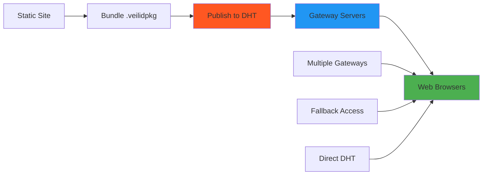

  

    <h1>P2P hosting that simply works</h1>
    
Deploy static content to the Veilid DHT with instant web access through gateway servers. <strong>Zero censorship, zero single points of failure</strong> – your content lives forever in the decentralized network.

    

      <a href="getting-started/" class="hero-button primary">Get started</a>
      <a href="architecture/" class="hero-button">Learn more</a>
    

  

## Everything you would expect

  

    
🚀

    <h3>Simple Deployment</h3>
    
Bundle your static sites and deploy to the Veilid DHT with one command. No complex configurations or setup required.

  

  
  

    
🌐

    <h3>Universal Access</h3>
    
Access your sites through gateway servers with automatic HTTPS and subdomain routing. Works in any web browser.

  

  
  

    
🛡️

    <h3>Censorship Resistant</h3>
    
No single point of failure. Content distributed across the Veilid network remains accessible even when gateways are blocked.

  

  
  

    
⚡

    <h3>Fast and Lightweight</h3>
    
High-performance caching and optimized delivery ensure your static sites load quickly for all users.

  

  
  

    
🔐

    <h3>Secure by Design</h3>
    
End-to-end encryption, cryptographic integrity, and user-controlled keys ensure your content remains secure.

  

  
  

    
🌍

    <h3>Globally Distributed</h3>
    
Automatic replication across geographic regions ensures global availability and resilience against outages.

  

## More than just static hosting

**Roselite** transforms how we think about web hosting by leveraging the power of peer-to-peer networks.

### :material-decentralized: Built-in Redundancy

Roselite makes your static sites **instantly accessible** with zero effort: say goodbye to costly hosting providers that can take your content down. Deploy your content with **cryptographic security** and **distributed availability** running entirely **across the Veilid network** at no recurring cost.

Even better: your content works **offline-first**, survives **gateway blocking**, and maintains **global availability** through multiple access points.

[Learn more about architecture](architecture/){ .md-button }

### :material-shield-check: Censorship Resistance

Content stored in the Veilid DHT cannot be easily censored or removed. With Roselite's **gateway redundancy** and **distributed access**, your static sites remain available even when individual access points are blocked.

Multiple gateways can serve the same content, creating a **resilient network** that adapts to blocking attempts and maintains availability across different jurisdictions.

[Learn about security](architecture/security-model/){ .md-button }

### :material-rocket-launch: Developer Experience

Some projects need more deployment flexibility than traditional hosting provides, which is why Roselite offers a **simple yet powerful** way to deploy **static sites** with **decentralized infrastructure**.

Deploy anything from documentation sites to portfolios, landing pages to blogs - all with the same simple workflow and **zero ongoing costs**.

[Get started now](getting-started/){ .md-button }

### :material-web: 10,000+ Sites Supported

**Deploy any static site generator**: Jekyll, Hugo, Next.js, Gatsby, Nuxt.js, and many more. Roselite works with **any static content**, making it the perfect hosting solution for modern web development workflows.

Use our simple CLI to **bundle and deploy** with minimal configuration, or integrate into your existing CI/CD pipelines for automated deployments.

[View CLI reference](reference/cli-commands/){ .md-button }

## Trusted by developers

### Industry adoption

**Open source projects**, **developers**, and **organizations** rely on Roselite to deploy documentation, portfolios, and web applications with **censorship resistance** and **global availability**.

[Get started](getting-started/){ .md-button .md-button--primary }

## What our users say

!!! quote "Decentralized Future"

    "Roselite represents the future of web hosting - truly decentralized, censorship-resistant, and developer-friendly. It's what the web should have been from the beginning."

    **– Anonymous Developer**

!!! quote "Perfect for Open Source"

    "We use Roselite for our project documentation because it ensures our docs remain available regardless of corporate decisions or infrastructure changes."

    **– Open Source Maintainer**

!!! quote "Censorship Resistance"

    "In regions where internet freedom is limited, Roselite provides a crucial service - ensuring information remains accessible when traditional hosting fails."

    **– Digital Rights Advocate**

## How it works

1. **Bundle** your static site files into a Veilid package
2. **Publish** the package to the distributed hash table
3. **Access** through gateway servers with automatic HTTPS
4. **Share** gateway URLs - fully accessible in any browser
5. **Survive** - content remains available despite blocking attempts

## Become a sponsor

By supporting Roselite development, you help build the infrastructure for a **censorship-resistant web**. Your sponsorship ensures continued development and maintenance of this critical technology.

**Together, we can build hosting that simply works!**

[Learn more about sponsoring](sponsor/){ .md-button } 