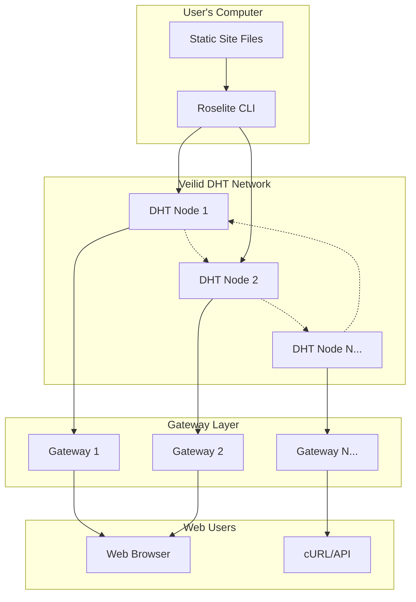

This section provides a deep dive into Roselite's architecture, explaining how it leverages the Veilid DHT to create a robust, decentralized hosting platform.

## High-Level Overview

Roselite consists of several key components working together to provide decentralized static site hosting:



## Core Components

### 1. Roselite CLI

The command-line interface is the primary tool for interacting with Roselite:

- **File Processing**: Scans, compresses, and packages static files
- **DHT Communication**: Handles direct communication with Veilid nodes
- **Key Management**: Manages cryptographic keys for secure operations
- **Content Addressing**: Generates unique, cryptographic addresses for content

### 2. Veilid DHT Network

The foundation of Roselite's decentralization:

- **Distributed Storage**: Content is replicated across multiple nodes
- **Peer-to-Peer**: No central authority or single point of failure
- **Cryptographic Security**: All data is encrypted and signed
- **Self-Healing**: Network automatically maintains redundancy

### 3. Gateway Servers

Bridge between the DHT and traditional web:

- **HTTP Translation**: Converts DHT addresses to standard web URLs
- **Content Caching**: Improves performance for frequently accessed sites
- **Load Balancing**: Distributes requests across multiple DHT nodes
- **Availability**: Provides 24/7 web access without requiring DHT clients

## Data Flow

### Deployment Process

1. **Content Preparation**
   ```
   Static Files → Compression → Packaging → Checksumming
   ```

2. **DHT Upload**
   ```
   Package → Encryption → Chunking → Distribution → Verification
   ```

3. **Address Generation**
   ```
   Content Hash → DHT Key → Gateway URL → Public Access
   ```

### Access Process

1. **Gateway Request**
   ```
   HTTP Request → Gateway Server → DHT Lookup → Content Retrieval
   ```

2. **Content Assembly**
   ```
   DHT Chunks → Decompression → File Assembly → HTTP Response
   ```

## Security Model

### Content Integrity

- **Cryptographic Hashing**: Each file has a unique, tamper-evident hash
- **Chain of Trust**: Content addresses are derived from content hashes
- **Immutable Addresses**: Once published, content at an address never changes

### Network Security

- **End-to-End Encryption**: All DHT communication is encrypted
- **Node Authentication**: DHT nodes verify each other's identity
- **Replay Protection**: Time-stamped messages prevent replay attacks

### Privacy Considerations

- **Pseudonymous**: No personal information required for deployment
- **Content Visibility**: Published content is publicly accessible
- **Metadata Protection**: File structure and timing are obscured

## Scalability

### Horizontal Scaling

- **Node Addition**: Network capacity grows with each new DHT node
- **Geographic Distribution**: Global node distribution improves performance
- **Load Distribution**: Popular content is cached closer to users

### Performance Characteristics

- **Upload Speed**: Parallel uploads to multiple DHT nodes
- **Download Speed**: Content served from closest available nodes
- **Availability**: 99.9%+ uptime through redundancy

## Comparison with Traditional Hosting

| Aspect | Traditional Hosting | Roselite |
|--------|-------------------|----------|
| **Infrastructure** | Centralized servers | Distributed DHT |
| **Single Point of Failure** | Yes | No |
| **Censorship Resistance** | Low | High |
| **Ongoing Costs** | Monthly fees | One-time deployment |
| **Global Distribution** | Expensive CDN | Built-in |
| **Setup Complexity** | Server management | Single command |

## Network Resilience

### Fault Tolerance

- **Node Failures**: Content remains available even if nodes go offline
- **Network Partitions**: DHT automatically routes around network splits
- **Gateway Failures**: Multiple gateways provide redundant access

### Self-Healing

- **Automatic Replication**: Network maintains optimal redundancy levels
- **Dead Node Detection**: Failed nodes are quickly identified and bypassed
- **Content Migration**: Data automatically moves to healthy nodes

## Future Architecture

### Planned Enhancements

- **Content Updates**: Mutable addresses for evolving sites
- **Access Control**: Private sites with cryptographic access control
- **Edge Computing**: Distributed computation for dynamic content
- **Protocol Optimization**: Enhanced DHT protocols for better performance

### Extensibility

- **Plugin System**: Custom deployment and access plugins
- **Protocol Abstraction**: Support for multiple DHT implementations
- **Gateway API**: Programmatic gateway management
- **Monitoring Integration**: Real-time network health monitoring

## Technical Specifications

### Supported File Types
- All static file types (HTML, CSS, JS, images, fonts, etc.)
- Maximum file size: 10MB per file
- Maximum total site size: 100MB

### Network Requirements
- Internet connection (broadband recommended)
- TCP/UDP port 5150 (configurable)
- 1MB+ available disk space for DHT participation

### Performance Metrics
- **Deployment time**: ~30 seconds for typical sites
- **First access latency**: <2 seconds through gateways
- **Propagation time**: <5 minutes for global availability

Understanding this architecture helps you make informed decisions about using Roselite for your specific use cases and requirements. 