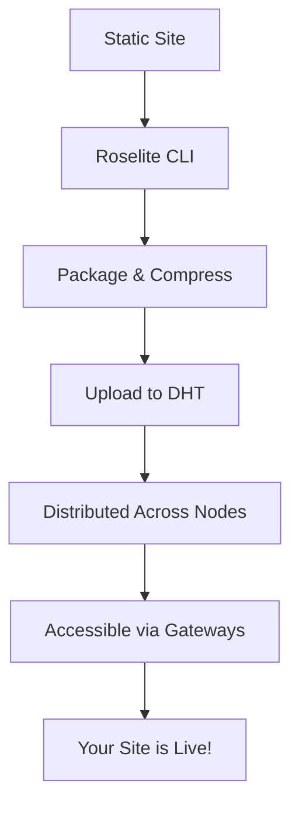

Welcome to Roselite! This guide will help you understand what Roselite is, how it works, and how to start using it for your static site hosting needs.

## What is Roselite?

Roselite is a **peer-to-peer static site hosting platform** built on top of the Veilid Distributed Hash Table (DHT). It enables you to deploy static websites that are:

- **Truly decentralized** - No central servers or single points of failure
- **Censorship resistant** - Content cannot be taken down once published
- **Persistent** - Your sites remain accessible as long as the network exists
- **Cost-effective** - No ongoing hosting fees

## How It Works

### The Technology Stack

1. **Veilid DHT**: The underlying distributed network that stores and distributes your content
2. **Roselite CLI**: Command-line tool for deploying and managing your sites
3. **Gateway Servers**: Bridge between the DHT and traditional web browsers
4. **Content Addressing**: Each site gets a unique, cryptographic address

### The Deployment Process

When you deploy a site with Roselite:

1. Your static files are packaged and compressed
2. Content is uploaded to the Veilid DHT network
3. The DHT automatically distributes your content across multiple nodes
4. Gateway servers make your content accessible via standard HTTP URLs
5. Your site is now live on the decentralized web!

## Key Benefits

### 🌐 True Decentralization
Unlike traditional CDNs or even some "decentralized" platforms, Roselite doesn't rely on any central infrastructure. Your content is distributed across a peer-to-peer network.

### 🚀 Instant Global Distribution
As soon as you deploy, your content is automatically replicated across the entire network, providing fast access from anywhere in the world.

### 🔒 Censorship Resistance
Once your content is on the DHT, it cannot be removed by any single authority. The distributed nature ensures your content remains accessible.

### 💰 No Ongoing Costs
Pay once to deploy, and your content remains hosted indefinitely. No monthly bills, no bandwidth charges.

### 🔧 Developer Friendly
Works with any static site generator (Jekyll, Hugo, Gatsby, Next.js, etc.) and integrates with existing CI/CD workflows.

## Prerequisites

Before getting started with Roselite, you'll need:

- **Rust toolchain** (for installing the CLI)
- **A static site** ready for deployment
- **Basic command line knowledge**

## Next Steps

Ready to deploy your first decentralized site? Continue with:

1. **[Installation](./installation/)** - Install the Roselite CLI
2. **[Quick Start](./quick-start/)** - Deploy your first site in minutes

## Need Help?

- Browse the [CLI reference](/cli/commands/)
- Visit our [GitHub repository](https://github.com/jdbohrman-tech/roselite) for issues and discussions 